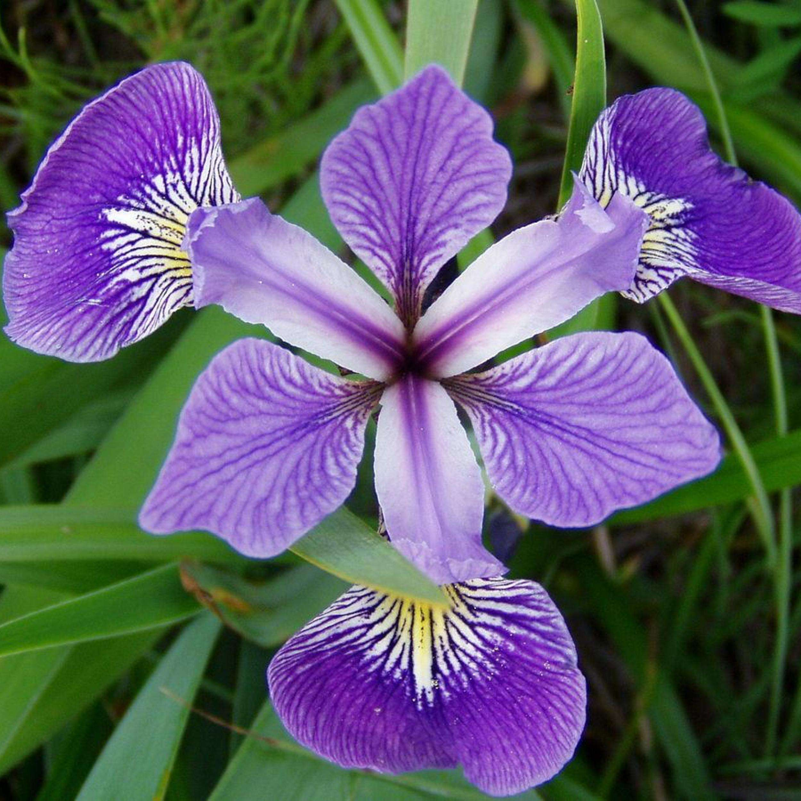
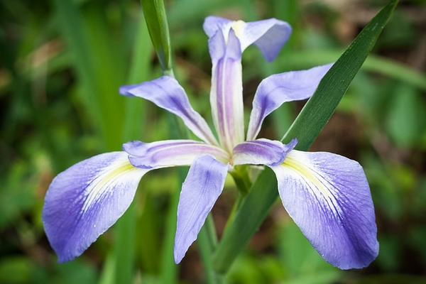

```{r setup, include=FALSE}
knitr::opts_chunk$set(echo = TRUE)

library(tidyverse)
knitr::opts_chunk$set(warning = FALSE, message = FALSE)
#Its common to have a setup area to help keep track of required packages and formatting options

library(tidyverse)  #importing, tidying, plotting data
library(knitr)      #making tables
library(leaflet)
library(tinytex)   #may need for knitting pdf versions of .rmd file
library(hexbin)

#knitr::opts_chunk$set(fig.width = 5, fig.asp = 1/3) #force figures to be a certain size and aspect ratio
#opts_chunk$set(echo=FALSE)   #can force hide all code in the output; disables 'code folding'
```

*Here are some ggplots.*

```{r 2-3 figures using ggplot }
data("iris")
ggplot(iris, aes(x = Sepal.Length, y = Sepal.Width)) + geom_point(size = 2)
ggsave("Sepal.Length_vs_Sepal.Width.png")

ggplot(iris, aes(x = Petal.Length, y = Petal.Width)) + geom_point(size = 2)
ggsave("Petal.Length_vs_Petal.Width.png")

ggplot(iris, aes(x = Sepal.Length, y = Petal.Length)) + geom_point(size = 2)
ggsave("Sepal.Length_vs_Petal.Length.png")
```

*Statistical Summaries*

```{R summaries}
model_1<- lm(Sepal.Length~Sepal.Width, data = iris)
anova(model_1)

model_2<- lm(Petal.Length~Petal.Width, data = iris)
anova(model_2)
```

*Table Summaries*

```{r 2-3 Table Summaries}
kable(iris [1:10, ], caption = 'Kable Table of first 10 rows in Iris')

summary1 <- summarise(group_by(iris, Species),
          n=n(), 
          mean=mean(Petal.Length),
          sd=sd(Petal.Length))  
kable(summary1, caption = 'Table 2. A summary kable displaying number, mean, and standard deviation for each of the petal length of different Iris species.', digits = c(0, 0, 1, 1))

```

*Pictures*

[Lets insert a static image, like a picture or figure. Notice that this is inline code, not inside a code chunk.]{style="color:blue"}   

## Including Plots

*Here is a nursery if you like plants. Go get a tree.*

```{r Map}
leaflet() %>%
  setView(-87.33769, 36.54045, zoom = 16) %>% #lat-long of the place of interest
  addTiles() %>%
  addMarkers(-87.33769, 36.54045, popup = "Larry's Nursery and Landscaping")
```

[Flowers](https://www.youtube.com/watch?v=08u4Z8Po5mQ&ab_channel=wandervanlaar)
